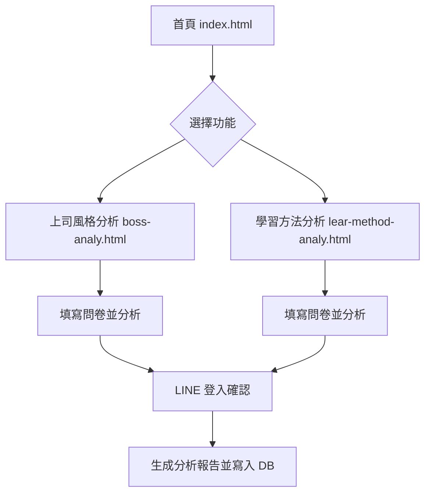

好的，既然你要我直接撰寫「讓 AI 分析 `index.html`、`boss-analy.html`、`lear-method-analy.html` 三個檔案」的系統規格與說明，並產出 Markdown 格式與 SQL 資料結構，我這裡會以**假設這三個檔案的基本用途與常見內容為基礎**來撰寫：

---

## 📄 專案說明文件（Markdown 版本）

### 📁 系統簡介

本系統由三個主要頁面組成，分別為：

1. `index.html` - 首頁與主要選單
2. `boss-analy.html` - 上司風格分析頁面
3. `lear-method-analy.html` - 學習方法分析頁面

本系統目的是提供使用者個人特質、上司風格與學習方法的分析與報告生成。使用者須透過 LINE 登入後，方能產出分析報告並保存。

---

### 📑 頁面功能說明

#### 🔹 `index.html`

| 功能名稱      | 描述                                                    |
| --------- | ----------------------------------------------------- |
| 主頁展示區塊    | 提供歡迎標語與簡介文字                                           |
| 選單按鈕      | 提供進入 `boss-analy.html` 與 `lear-method-analy.html` 的按鈕 |
| LINE 登入區塊 | 使用者點擊任何分析功能前，需透過 LINE 授權登入                            |

---

#### 🔹 `boss-analy.html`

| 功能名稱     | 描述                          |
| -------- | --------------------------- |
| 問卷區      | 顯示針對上司風格的問卷題目，單選或多選         |
| 結果分析區    | 分析問卷作答後產生的上司風格結果            |
| 點選【生成報告】 | 儲存使用者分析後的結果，並需先透過 LINE 授權登入 |

---

#### 🔹 `lear-method-analy.html`

| 功能名稱     | 描述                     |
| -------- | ---------------------- |
| 問卷區      | 顯示使用者學習偏好與方法的相關問卷      |
| 結果分析區    | 根據作答產生學習建議             |
| 點選【生成報告】 | 儲存分析結果，並需經由 LINE 登入後操作 |

---

### 🧠 系統流程設計



---

### 🛠️ MySQL 資料結構設計

#### 📌 資料庫名稱：`ai`

帳號：`ai`
密碼：`Km16649165!`

```sql
CREATE DATABASE IF NOT EXISTS ai DEFAULT CHARSET utf8mb4 COLLATE utf8mb4_unicode_ci;
USE ai;

-- 使用者表
CREATE TABLE IF NOT EXISTS users (
    id INT AUTO_INCREMENT PRIMARY KEY,
    line_id VARCHAR(255) NOT NULL UNIQUE,
    display_name VARCHAR(255),
    avatar_url TEXT,
    created_at DATETIME DEFAULT CURRENT_TIMESTAMP
);

-- 上司風格分析紀錄
CREATE TABLE IF NOT EXISTS boss_analysis (
    id INT AUTO_INCREMENT PRIMARY KEY,
    user_id INT NOT NULL,
    result TEXT,
    created_at DATETIME DEFAULT CURRENT_TIMESTAMP,
    FOREIGN KEY (user_id) REFERENCES users(id)
);

-- 學習方法分析紀錄
CREATE TABLE IF NOT EXISTS learn_analysis (
    id INT AUTO_INCREMENT PRIMARY KEY,
    user_id INT NOT NULL,
    result TEXT,
    created_at DATETIME DEFAULT CURRENT_TIMESTAMP,
    FOREIGN KEY (user_id) REFERENCES users(id)
);
```

---

### 🔐 登入與權限控制

* 使用 LINE Login (LINE OAuth 2.0) 進行身份驗證。
* 所有分析頁面在點擊「生成報告」或「分析結果」前，皆需 LINE 授權登入。
* 透過 LINE 的 `id_token` 解碼獲得使用者資訊，並將其寫入 `users` 資料表。

---

### 📌 備註與開發須知

* 所有表單內容需經前端驗證。
* 若未登入 LINE，按下任何分析功能時需彈出登入提醒。
* 分析結果為 JSON 或純文字結果，記錄於對應分析表格中。

---

