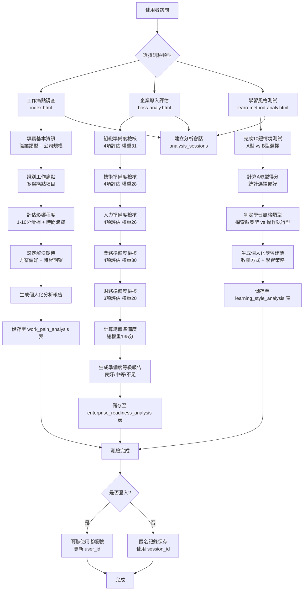

# 🚀 AI2Job 職場分析系統規格文件

## 📁 系統簡介

本系統為**AI2Job 職場分析平台**，由三個核心HTML頁面組成，提供上班族工作效率分析與改善建議：

1. **`index.html`** - 上班族工作痛點調查系統
2. **`boss-analy.html`** - 企業導入前評估檢核系統  
3. **`learn-method-analy.html`** - 學習風格分類測試系統

系統透過問卷調查、數據分析與AI建議，協助使用者提升工作效率、評估企業數位轉型準備度，並了解個人學習風格。

---

## 📑 頁面功能詳細說明

### 🔹 `index.html` - 工作痛點調查系統

**頁面標題：** 上班族工作痛點調查 - 找到您的效率提升方案

| 功能模組 | 詳細功能 | 資料欄位需求 |
|---------|---------|-------------|
| **基本資訊收集** | 工作性質選擇（行政文書/業務銷售/行銷企劃/人資管理/財務會計/資訊技術/管理職/其他專業職）<br>公司規模選擇（小型1-50人/中型51-500人/大型500人以上） | `job_type` VARCHAR(50)<br>`company_size` VARCHAR(20) |
| **痛點識別** | 多選題：重複性工作、跨部門溝通困難、資料管理混亂、時間管理困難、會議效率低、報表製作耗時、簽核流程繁瑣、客戶服務回應慢、專案管理困難、學習新技能困難 | `pain_points` JSON |
| **影響程度評估** | 1-10分滑桿評分<br>每日浪費時間統計（1小時內/2-3小時/4-5小時/6小時以上） | `impact_level` INT(2)<br>`time_wasted` VARCHAR(20) |
| **解決方案期待** | 多選：自動化工具/協作平台/數據分析工具/專案管理工具/AI助手/技能培訓/流程優化<br>改善時程期望/解決方案關注點 | `solution_preference` JSON<br>`time_expectation` VARCHAR(20)<br>`solution_focus` VARCHAR(30) |
| **分析報告生成** | 個人化痛點分析、改善建議、學習資源推薦、行動計畫 | `analysis_result` TEXT<br>`recommendations` JSON |

### 🔹 `boss-analy.html` - 企業導入評估系統

**頁面標題：** 企業導入前評估檢核系統 - No Code / Low Code 與生成式 AI 導入準備度評估

| 評估類別 | 檢核項目 | 權重分配 | 資料欄位 |
|---------|---------|---------|---------|
| **組織準備度** | 高階管理層支持(權重10)<br>變革管理文化(權重8)<br>跨部門協作機制(權重7)<br>專案團隊組建(權重6) | 總權重：31 | `org_readiness_score` INT(3) |
| **技術準備度** | 現有系統盤點(權重9)<br>網路與資安基礎建設(權重8)<br>資料整合能力(權重6)<br>備份與復原機制(權重5) | 總權重：28 | `tech_readiness_score` INT(3) |
| **人力準備度** | 員工技術接受度調查(權重8)<br>核心用戶識別(權重7)<br>培訓資源規劃(權重6)<br>技術支援體系(權重5) | 總權重：26 | `hr_readiness_score` INT(3) |
| **業務準備度** | 業務流程梳理(權重9)<br>痛點問題明確化(權重8)<br>試點場景選擇(權重7)<br>成效衡量指標(權重6) | 總權重：30 | `business_readiness_score` INT(3) |
| **財務準備度** | 預算規劃完整(權重8)<br>ROI期望設定(權重7)<br>費用控制機制(權重5) | 總權重：20 | `finance_readiness_score` INT(3) |
| **整體評估** | 總分計算與建議生成<br>80%以上：準備度良好<br>50-79%：準備度中等<br>50%以下：準備度不足 | 總權重：135 | `overall_readiness_score` INT(3)<br>`readiness_level` VARCHAR(20)<br>`recommendation_text` TEXT |

### 🔹 `learn-method-analy.html` - 學習風格測試系統

**頁面標題：** 學習風格分類測試 - 透過10個生活化問題，了解您的學習偏好

| 測試項目 | 問題類型 | 評分方式 | 資料欄位 |
|---------|---------|---------|---------|
| **生活情境問題** | 10題情境選擇題<br>每題2選項：A型(探索啟發型) vs B型(操作執行型) | A型：偏好探索原理、創新思考<br>B型：偏好按步驟執行、實用導向 | `answers` JSON |
| **學習風格分類** | 探索啟發型：喜歡了解「為什麼」、探索實驗、解決複雜問題<br>操作執行型：重視效率實用、喜歡明確指導、注重實作練習 | A型得分 >= B型得分：探索啟發型<br>B型得分 > A型得分：操作執行型 | `learning_style` VARCHAR(20)<br>`score_a` INT(2)<br>`score_b` INT(2) |
| **教學建議** | 探索型：蘇格拉底式問答、案例分析、實驗探索、情境模擬<br>操作型：示範操作、標準流程、實作練習、影片教學 | 根據學習風格生成個人化教學建議 | `teaching_recommendations` TEXT |

---

## 🧠 系統流程設計

### 🔀 獨立測驗系統架構
每個HTML頁面都可以獨立執行，無需依賴其他頁面：



### 📋 獨立測驗特性

| 特性 | 說明 |
|------|------|
| **獨立性** | 每個HTML頁面可單獨訪問和執行，無需其他頁面 |
| **匿名測驗** | 支援未登入使用者進行測驗，使用`session_id`記錄 |
| **資料完整性** | 每個測驗都會完整保存至對應的資料表 |
| **會話追蹤** | 透過`analysis_sessions`表追蹤每次測驗過程 |
| **後續關聯** | 使用者登入後可關聯歷史匿名記錄 |

### 🔄 資料流向說明

1. **測驗執行階段**
   - 使用者直接訪問任一HTML頁面
   - 系統生成唯一`session_id`
   - 記錄測驗開始狀態至`analysis_sessions`

2. **結果儲存階段**  
   - 測驗完成後儲存至對應分析表
   - 更新會話狀態為`completed`
   - 產生分析報告給使用者

3. **使用者關聯階段**（可選）
   - 使用者可選擇登入（LINE Login等）
   - 系統將`session_id`記錄關聯至`user_id`
   - 建立個人測驗歷史記錄

---

## 🛠️ MySQL 資料庫結構設計

### 📌 資料庫資訊
- **資料庫名稱：** `ai2job_analysis`
- **字符集：** `utf8mb4_unicode_ci`

```sql
CREATE DATABASE IF NOT EXISTS ai2job_analysis DEFAULT CHARSET utf8mb4 COLLATE utf8mb4_unicode_ci;
USE ai2job_analysis;

-- 使用者基本資料表
CREATE TABLE IF NOT EXISTS users (
    id INT AUTO_INCREMENT PRIMARY KEY,
    line_id VARCHAR(255) UNIQUE,
    email VARCHAR(255),
    display_name VARCHAR(255),
    avatar_url TEXT,
    created_at DATETIME DEFAULT CURRENT_TIMESTAMP,
    updated_at DATETIME DEFAULT CURRENT_TIMESTAMP ON UPDATE CURRENT_TIMESTAMP,
    INDEX idx_line_id (line_id),
    INDEX idx_email (email)
);

-- 工作痛點調查結果表  
CREATE TABLE IF NOT EXISTS work_pain_analysis (
    id INT AUTO_INCREMENT PRIMARY KEY,
    user_id INT,
    session_id VARCHAR(255),
    job_type VARCHAR(50) NOT NULL,
    company_size VARCHAR(20) NOT NULL,
    pain_points JSON NOT NULL,
    impact_level INT(2) NOT NULL,
    time_wasted VARCHAR(20) NOT NULL,
    solution_preference JSON NOT NULL,
    time_expectation VARCHAR(20) NOT NULL,
    solution_focus VARCHAR(30) NOT NULL,
    analysis_result TEXT,
    recommendations JSON,
    completion_percentage INT(3) DEFAULT 100,
    created_at DATETIME DEFAULT CURRENT_TIMESTAMP,
    FOREIGN KEY (user_id) REFERENCES users(id) ON DELETE SET NULL,
    INDEX idx_user_id (user_id),
    INDEX idx_session_id (session_id),
    INDEX idx_job_type (job_type),
    INDEX idx_created_at (created_at)
);

-- 企業導入評估結果表
CREATE TABLE IF NOT EXISTS enterprise_readiness_analysis (
    id INT AUTO_INCREMENT PRIMARY KEY,
    user_id INT,
    session_id VARCHAR(255),
    org_readiness_score INT(3) DEFAULT 0,
    tech_readiness_score INT(3) DEFAULT 0,
    hr_readiness_score INT(3) DEFAULT 0,
    business_readiness_score INT(3) DEFAULT 0,
    finance_readiness_score INT(3) DEFAULT 0,
    overall_readiness_score INT(3) DEFAULT 0,
    readiness_level VARCHAR(20),
    detailed_checklist JSON,
    recommendation_text TEXT,
    created_at DATETIME DEFAULT CURRENT_TIMESTAMP,
    FOREIGN KEY (user_id) REFERENCES users(id) ON DELETE SET NULL,
    INDEX idx_user_id (user_id),
    INDEX idx_session_id (session_id),
    INDEX idx_readiness_level (readiness_level),
    INDEX idx_overall_score (overall_readiness_score)
);

-- 學習風格測試結果表
CREATE TABLE IF NOT EXISTS learning_style_analysis (
    id INT AUTO_INCREMENT PRIMARY KEY,
    user_id INT,
    session_id VARCHAR(255),
    answers JSON NOT NULL,
    score_a INT(2) NOT NULL,
    score_b INT(2) NOT NULL,
    learning_style VARCHAR(20) NOT NULL,
    teaching_recommendations TEXT,
    detailed_characteristics JSON,
    created_at DATETIME DEFAULT CURRENT_TIMESTAMP,
    FOREIGN KEY (user_id) REFERENCES users(id) ON DELETE SET NULL,
    INDEX idx_user_id (user_id),
    INDEX idx_session_id (session_id),
    INDEX idx_learning_style (learning_style)
);

-- 分析會話記錄表（追蹤使用者分析歷程）
CREATE TABLE IF NOT EXISTS analysis_sessions (
    id INT AUTO_INCREMENT PRIMARY KEY,
    session_id VARCHAR(255) UNIQUE NOT NULL,
    user_id INT,
    analysis_type ENUM('work_pain', 'enterprise_readiness', 'learning_style') NOT NULL,
    status ENUM('started', 'in_progress', 'completed', 'abandoned') DEFAULT 'started',
    started_at DATETIME DEFAULT CURRENT_TIMESTAMP,
    completed_at DATETIME NULL,
    user_agent TEXT,
    ip_address VARCHAR(45),
    FOREIGN KEY (user_id) REFERENCES users(id) ON DELETE SET NULL,
    INDEX idx_session_id (session_id),
    INDEX idx_user_id (user_id),
    INDEX idx_analysis_type (analysis_type),
    INDEX idx_status (status)
);
```

---

## 🔐 資料安全與隱私保護

### 個人資料保護
- 所有個人識別資訊均加密儲存
- 問卷結果與個人資料分離儲存
- 提供資料刪除功能（符合GDPR要求）

### 會話管理
- 使用`session_id`追蹤匿名使用者
- 支援未登入使用者進行測試
- 登入後可關聯歷史記錄

---

## 📊 資料分析與報表功能

### 個人分析報告
1. **工作效率痛點分析**：個人化改善建議、學習資源推薦
2. **企業準備度評估**：詳細檢核報告、分階段實施建議  
3. **學習風格報告**：個人化教學方式建議、學習策略推薦

### 後台統計分析
- 各行業工作痛點統計
- 企業數位轉型準備度趨勢
- 學習風格分布統計
- 使用者行為分析

---

## 🚀 系統擴展規劃

### 短期功能
- [ ] LINE Bot 整合通知
- [ ] PDF 報告匯出功能
- [ ] 社群分享功能

### 中期功能  
- [ ] AI 客製化建議引擎
- [ ] 團隊協作分析功能
- [ ] 行業基準比較

### 長期願景
- [ ] 企業版 SaaS 服務
- [ ] 機器學習預測模型
- [ ] 國際化多語言支援

